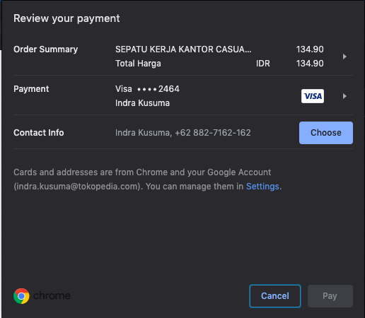

# Web Payements

Web Payments is an emerging web standard being developed by the W3C to simplify online payments and enable a broader set of players to participate easily in the payments ecosystem on the web. The standards are flexible; they work with various types of payment systems and are intended to work on any browser on any device, payment method, or payment service provider. This flexibility enables development simplicity, deployment consistency, and future compatibility with emerging payment technologies.

With Web Payment, we get lots of benefit like,
**For Consumer**, the simplify checkout flow by making few taps instead of typing small characters many times on virtual keyboards.

**For Merchant**, they allow bringing any type of payment methods to the web with relatively easy integration.

**For payment service providers**, they bring new payment methods and enhance the ability of businesses to serve more customers with a better developer experience and more secure solutions.

## Demo

You can run this project by clone this repo to your local machine, then run `yarn install`. After that, run this project by `yarn start`. If your browser support for web payment API, you will show this popup.

This repo for learning purpose.